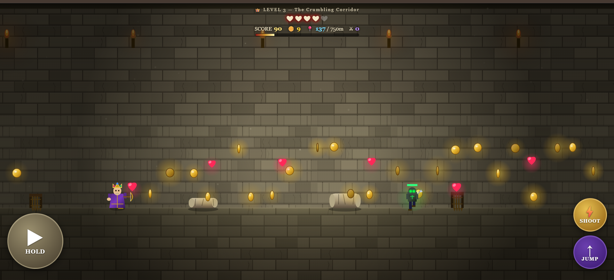
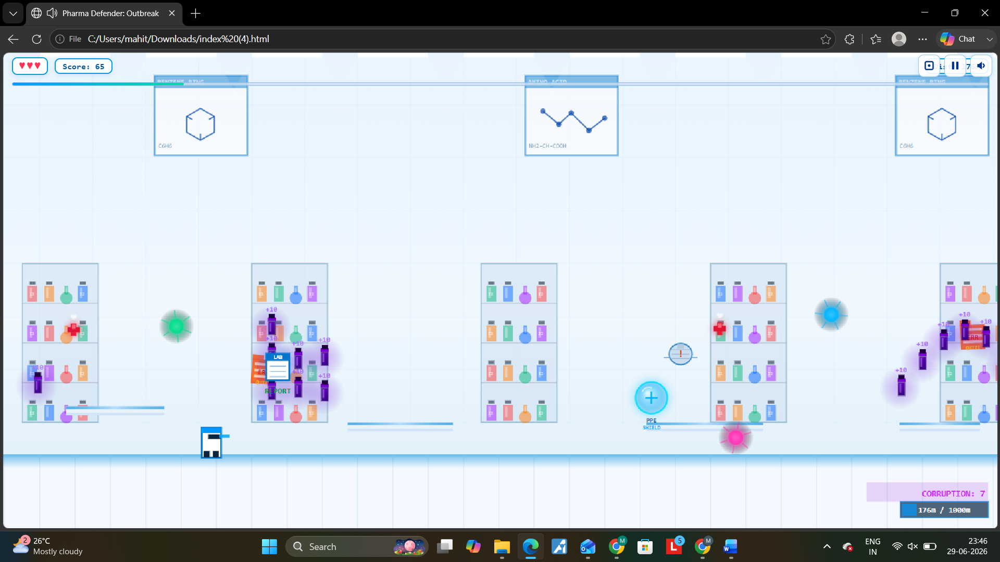
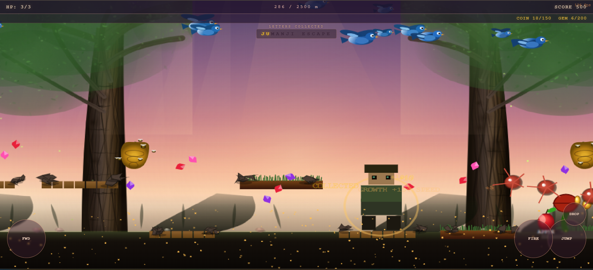
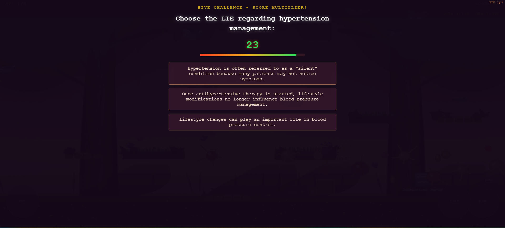
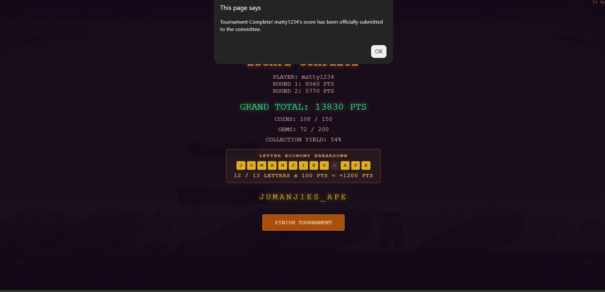

# Pharma Defender

**An educational 2D action game developed for RXSCAPE 2026, blending arcade gameplay with pharmaceutical learning.**

Pharma Defender is a browser-based 2D educational action game created for RXSCAPE 2026, an event organized by the American Association of Pharmaceutical Scientists (AAPS) Student Chapter, Bombay College of Pharmacy.

Designed to make pharmaceutical education engaging and interactive, the game combines fast-paced arcade shooter mechanics with pharmacy-themed quiz checkpoints. Players battle infectious pathogens, collect power-ups, overcome hazards, and answer pharmaceutical questions while competing for the highest score.

Developed specifically for the event, the game was played by numerous participants and became one of the most appreciated digital attractions of RXSCAPE 2026.

---

## 🎮 Play Online
*   **Trial Round :** *https://aaps-trial-round-pharma-defender.netlify.app/*
*   **Main Game :** *https://aaps-pharma-defender.netlify.app/*

---

## ✨ Features

*   🎮 **Browser-based 2D side-scrolling action gameplay**
*   💊 **Pharmacy-themed educational quiz system**
*   📱 **Responsive controls for desktop and mobile**
*   🦠 **Multiple enemy types and environmental hazards**
*   ⚡ **Power-up system with collectible boosts**
*   ❤️ **Health, lives, and scoring system**
*   🏆 **Progressive gameplay and increasing difficulty**
*   🔊 **Dynamic browser-generated sound effects** using the Web Audio API
*   🎨 **Particle effects, UI animations, and screen effects**
*   🚀 **No installation required**

---

## 🎮 Gameplay

Players progress through pharmaceutical laboratory environments while battling infectious pathogens, avoiding environmental hazards, collecting power-ups, and answering pharmacy-related questions to earn bonus rewards.

Throughout the game, players must:
*   Eliminate enemies
*   Dodge laboratory hazards
*   Collect health and power-ups
*   Complete pharmacy quiz checkpoints
*   Earn bonus points
*   Achieve the highest possible score

The game combines classic arcade mechanics with educational content to reinforce pharmaceutical concepts in an engaging way.

---

## 🏛 About RXSCAPE

RXSCAPE 2026 was an interactive event organized by the AAPS Student Chapter at Bombay College of Pharmacy, bringing together students through competitions, educational activities, and industry engagement.

Pharma Defender served as one of the event's flagship digital experiences, offering participants an entertaining way to test both their gaming skills and pharmaceutical knowledge.

---

## 💻 Tech Stack

Built with:
*   HTML5
*   CSS3
*   JavaScript (ES6)
*   HTML5 Canvas API
*   Web Audio API
*   Responsive Web Design

---

## 📂 Repository Structure

```text
pharma-defender/
│
├── README.md
├── screenshots/
│   ├── gameplay1.png
│   ├── gameplay2.png
│   ├── quiz.png
│   └── ending.png
│
├── trial-round/
│   └── index.html
│
└── main-game/
    ├── round1.html
    └── round2.html
```

---

## 🚀 Getting Started

**Clone the repository:**
```bash
git clone https://github.com/mahitdc/pharma-defender.git
```

**Navigate into the project:**
```bash
cd pharma-defender
```

**Open either game directly in your browser:**
```text
main-game/round1.html
```
*or*
```text
main-game/round2.html
```

*No installation, package manager, or build process is required.*

---

## 🎨 Game Highlights

*   Educational pharmacy quiz mechanics
*   Responsive touch controls
*   Dynamic enemy encounters
*   Power-up collection system
*   Health and score tracking
*   Animated particle effects
*   Browser-generated audio
*   Mobile-friendly gameplay
*   Progressive level design

---

## 👨‍💻 Development

This project was developed under a tight event timeline using AI-assisted development to accelerate implementation. 

My primary contributions included:
*   Designing the gameplay experience
*   Implementing and refining game mechanics
*   Debugging and resolving gameplay issues
*   Balancing difficulty and scoring
*   Optimizing performance for mobile devices
*   Integrating educational quiz mechanics
*   Testing extensively before the live event
*   Deploying the final production build for RXSCAPE 2026

---

## 📸 Screenshots

<div align="center">
  
  
  <br>
  
  
  <br>
  
</div>

---

## 🌟 Event Impact

*   ✅ **Developed for a live college event**
*   👥 **Played by numerous participants** throughout RXSCAPE 2026
*   🎉 **One of the most appreciated digital attractions** of the event
*   📚 **Successfully combined education** with interactive gameplay
*   🎮 **Demonstrated how gamification can enhance** pharmaceutical learning

---

## 🤝 Acknowledgements

Special thanks to:
*   AAPS Student Chapter, Bombay College of Pharmacy
*   RXSCAPE 2026 Organizing Committee
*   All participants who played the game and provided valuable feedback
